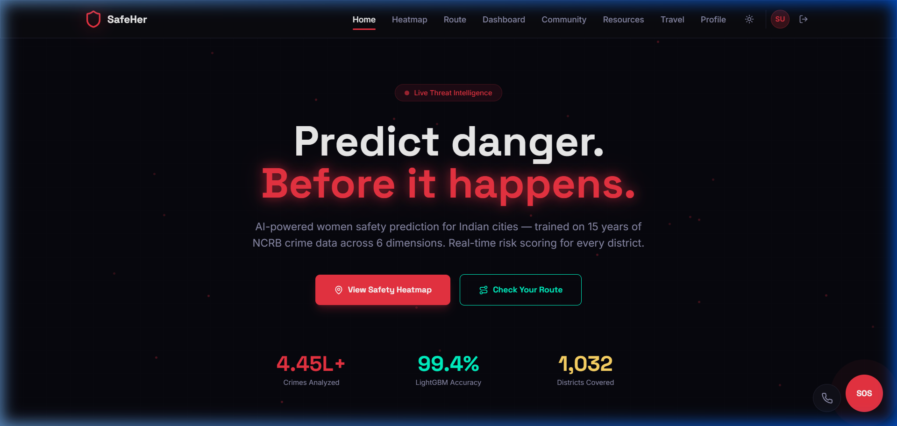
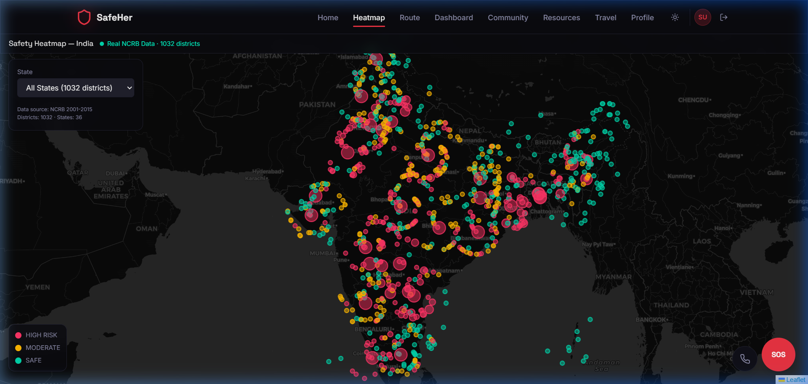
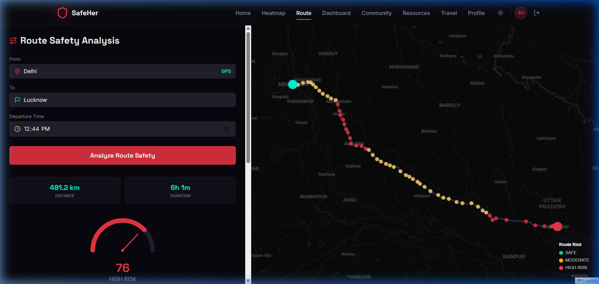
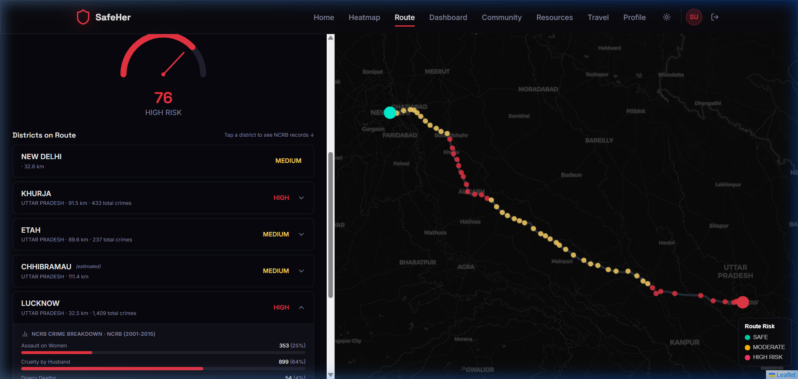
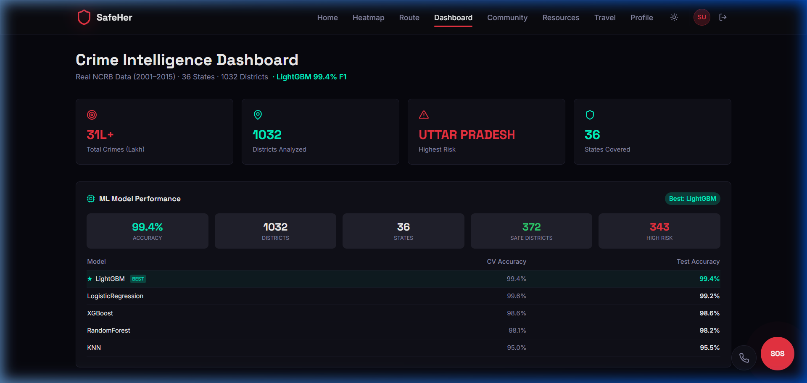
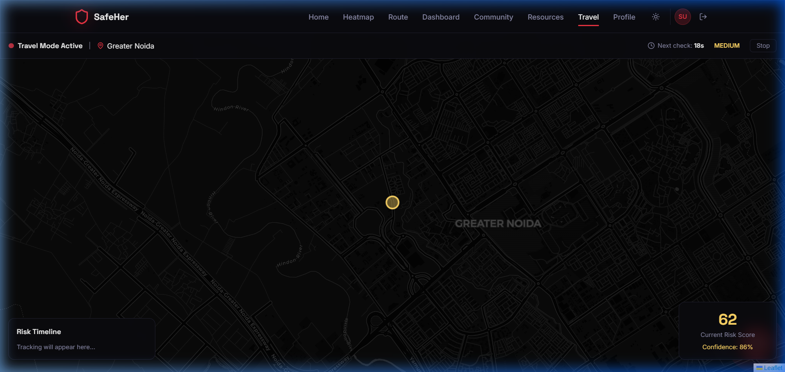
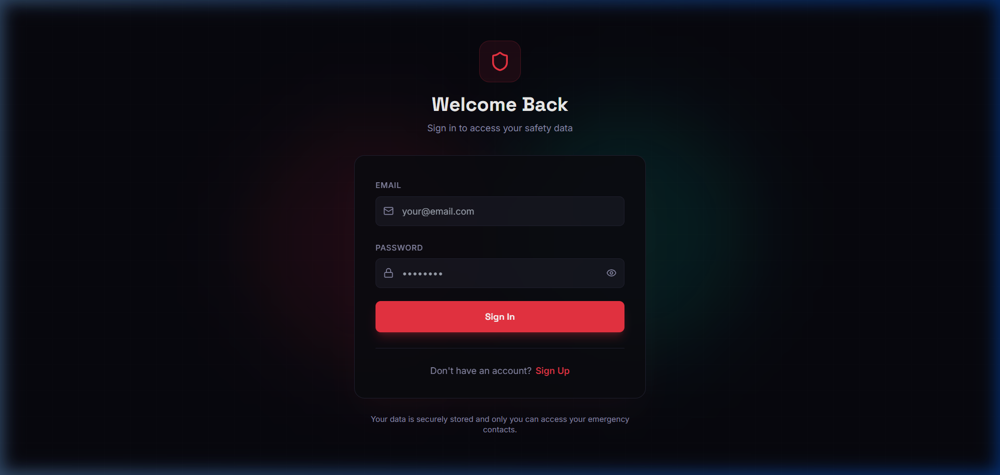

<p align="center">
  
</p>

<h1 align="center">🛡️ SafeHer — AI-Powered Women Safety Platform</h1>

<p align="center">
  ⭐ <b>If you liked this Project then please consider giving it a Star!</b> ⭐
</p>

<p align="center">
  <b>Predict danger. Before it happens.</b><br/>
  Real-time crime intelligence for 1,032 districts across 36 Indian States & Union Territories,<br/>
  powered by 15 years of NCRB data and a LightGBM ML model with 99.4% accuracy.
</p>

<p align="center">
  
  
  
  
  
</p>

<p align="center">
  
  
  
  
  
</p>

---

## 📸 Screenshots

### 🏠 Landing Page
<p align="center">
  
</p>

### 🗺️ Safety Heatmap — 1,032 Districts
Interactive crime heatmap showing risk levels for every district in India. Filter by state, click any district for detailed crime statistics.
<p align="center">
  
</p>

### 🛣️ Route Safety Analysis with Heatmap Dots
Analyze any route between two locations. The map shows **heatmap-style colored dots** along the route — green (safe), yellow (moderate), red (high risk) — based on real NCRB crime data for each district the route passes through.
<p align="center">
  
</p>

### 📊 District Crime Records (Expandable)
Tap any district on the route to see the **full NCRB crime breakdown** — Assault, Kidnapping, Rape, Dowry Deaths, Cruelty — with percentages and progress bars.
<p align="center">
  
</p>

### 📈 Crime Intelligence Dashboard
Real-time dashboard powered by ML model predictions. Shows total crimes analyzed, model accuracy comparisons (LightGBM vs XGBoost vs RandomForest), state rankings, and crime type breakdowns.
<p align="center">
  
</p>

### 🧭 Travel Guardian Mode
Live GPS tracking with continuous safety monitoring. Automatically evaluates your current location against the ML model every 30 seconds, showing a real-time risk score and confidence level.
<p align="center">
  
</p>

### 🔐 Secure Authentication
Firebase-powered authentication with persistent user profiles and emergency contacts synced to Firestore cloud database.
<p align="center">
  
</p>

---

## ✨ Features

### 🤖 Machine Learning Engine
| Feature | Detail |
|---------|--------|
| **Model** | LightGBM (Gradient Boosted Trees) |
| **Training Data** | Real NCRB Crime Records (2001–2015) — 10,921 district-year rows |
| **Crime Types** | Rape, Kidnapping, Dowry Deaths (`dowry`), Assault on Women (`assault`), Insult to Modesty (`insult`), Cruelty by Husband (`cruelty`) |
| **Coverage** | 1,032 districts across 28 States + 8 Union Territories (36 total) |
| **Accuracy** | 99.4% F1 Score (LightGBM) |
| **Training Features** | 18 features: 6 raw crime counts + `total_crimes`, `risk_score`, 4 ratios, `crime_trend`, `police_total`, `ipc_total`, `state_enc`, `district_enc`, `year` |
| **Risk Score Formula** | `rape×3.0 + kidnapping×2.5 + assault×2.0 + dowry×2.0 + cruelty×1.5 + insult×1.0` |
| **Risk Labels** | Within-year quantile split → 0=SAFE, 1=MODERATE, 2=HIGH RISK (~33% each) |
| **Time Awareness** | Risk adjusts by time of day: Night (10pm–6am) = +40%, Evening (6–10pm) = +15% |

### 🗺️ Interactive Safety Heatmap
- Full-screen dark-themed map with **1,032 district markers**
- Color-coded risk levels: 🟢 Safe · 🟡 Moderate · 🔴 High Risk
- Filter by state to focus analysis
- Click any marker for detailed crime statistics
- Real NCRB data source badge

### 🛣️ Route Safety Analyzer
- Enter any start/end location in India
- **5-point waypoint sampling** for comprehensive district coverage
- **Heatmap dots** along the route colored by district risk level
- **Expandable NCRB crime breakdown** per district (with progress bars)
- Overall safety gauge (0–100) with refined scoring formula
- Nearby police station detection via Overpass API
- GPS auto-fill for current location

### 🚨 Emergency SOS System
- **One-tap SOS button** always visible (bottom-right, red pulsing button)
- 5-second countdown with cancel option before alert fires
- Sends emergency email to saved contacts via SMTP with live GPS location link
- **Shake Detection** — triggers SOS when phone is shaken vigorously

### 📞 Fake Call Feature
- Floating **phone icon button** sits beside the SOS button
- Simulates a realistic incoming phone call (ringing + vibration)
- Useful when a woman feels unsafe — she can "take a call" to excuse herself from a situation without needing anyone to actually call her
- Caller name is customizable in Profile settings
- Full-screen incoming call UI with Answer / Decline buttons

### 👥 Community Incident Reporting
- **Anonymous** incident reporting (no personal info collected)
- GPS auto-detection of incident location
- Categories: Harassment, Stalking, Poor Lighting, Unsafe Area, Other
- Real-time map visualization of all reports
- **Delete your own reports** (tracked via browser fingerprint)
- SQLite-backed persistence

### 🧭 Travel Guardian Mode
- **Live GPS tracking** with continuous monitoring
- Safety score updated every 30 seconds
- Risk timeline showing changes as you move
- Nearby police stations overlay
- ML confidence indicator

### 👤 User Profile & Data Persistence
- Firebase Authentication (Email/Password)
- Emergency contacts stored in **Firestore** (cloud-synced)
- Offline-first with automatic sync when reconnected
- User profile with personal safety settings

---

## 🏗️ Architecture

```
┌─────────────────────────────────────────────────────────────┐
│                     FRONTEND (React + Vite)                 │
│  ┌──────────┐ ┌──────────┐ ┌──────────┐ ┌──────────┐      │
│  │ Heatmap  │ │  Route   │ │Dashboard │ │Community │      │
│  │  Page    │ │ Analyzer │ │   Page   │ │ Reports  │      │
│  └────┬─────┘ └────┬─────┘ └────┬─────┘ └────┬─────┘      │
│       │             │            │             │            │
│       └─────────────┴─────┬──────┴─────────────┘            │
│                           │                                 │
│                    api.ts (Service Layer)                    │
│                           │                                 │
│  ┌──────────────┐  ┌──────┴───────┐  ┌───────────────┐     │
│  │Firebase Auth │  │  REST API    │  │  Leaflet Maps │     │
│  │+ Firestore   │  │  Calls       │  │  + OSRM       │     │
│  └──────────────┘  └──────┬───────┘  └───────────────┘     │
└────────────────────────────┼────────────────────────────────┘
                             │
                             ▼
┌─────────────────────────────────────────────────────────────┐
│                   BACKEND (Flask + Python)                   │
│  ┌──────────┐ ┌──────────┐ ┌──────────┐ ┌──────────┐      │
│  │ /api/    │ │ /api/    │ │ /api/    │ │ /api/    │      │
│  │ heatmap  │ │ safety   │ │incidents │ │sos/email │      │
│  └────┬─────┘ └────┬─────┘ └────┬─────┘ └────┬─────┘      │
│       │             │            │             │            │
│       └─────────────┴─────┬──────┘             │            │
│                           │                    │            │
│               ┌───────────┴──────────┐  ┌──────┴───────┐   │
│               │  SafetyPredictor     │  │  SMTP Email  │   │
│               │  (LightGBM Model)    │  │  Service     │   │
│               │  risk_lookup.json    │  └──────────────┘   │
│               │  master_dataset.csv  │                      │
│               └──────────────────────┘                      │
│                                                             │
│               ┌──────────────────────┐                      │
│               │  SQLite (incidents)  │                      │
│               └──────────────────────┘                      │
└─────────────────────────────────────────────────────────────┘
```

---

## 🚀 Quick Start

### Prerequisites
- **Node.js** (v18+) and **npm**
- **Python** (v3.10+) and **pip**
- **Firebase** project (for authentication)

### 1. Clone the Repository
```bash
git clone https://github.com/YOUR_USERNAME/SafeHer.git
cd SafeHer
```

### 2. Backend Setup
```bash
cd backend

# Create virtual environment
python -m venv venv

# Activate (Windows)
venv\Scripts\activate
# Activate (macOS/Linux)
# source venv/bin/activate

# Install dependencies
pip install -r requirements.txt

# Create .env file
cp .env.example .env
# Edit .env with your SMTP email credentials for SOS feature

# Start the backend
python app.py
```
The Flask server will start on `http://localhost:5000`

### 3. Frontend Setup
```bash
cd frontend

# Install dependencies
npm install

# Create .env file
cp .env.example .env
# Edit .env with your Firebase configuration

# Start the frontend
npm run dev
```
The Vite dev server will start on `http://localhost:5173`

### 4. Firebase Setup
1. Create a project at [Firebase Console](https://console.firebase.google.com/)
2. Enable **Authentication** → Email/Password provider
3. Create a **Firestore Database** (start in test mode)
4. Copy the Firebase config into `frontend/.env`:
```env
VITE_FIREBASE_API_KEY=your_api_key
VITE_FIREBASE_AUTH_DOMAIN=your_project.firebaseapp.com
VITE_FIREBASE_PROJECT_ID=your_project_id
VITE_FIREBASE_STORAGE_BUCKET=your_project.appspot.com
VITE_FIREBASE_MESSAGING_SENDER_ID=your_sender_id
VITE_FIREBASE_APP_ID=your_app_id
```

5. Set Firestore Security Rules:
```
rules_version = '2';
service cloud.firestore {
  match /databases/{database}/documents {
    match /users/{userId} {
      allow read, write: if request.auth != null && request.auth.uid == userId;
    }
  }
}
```

---

## 📂 Project Structure

```
SafeHer/
├── backend/
│   ├── app.py                    # Flask application entry point
│   ├── requirements.txt          # Python dependencies
│   ├── ml/
│   │   ├── predict.py            # SafetyPredictor class (ML inference)
│   │   ├── train.py              # Model training script
│   │   ├── preprocess.py         # Data preprocessing
│   │   └── models/
│   │       ├── risk_lookup.json  # Pre-computed district risk scores
│   │       └── training_results.json
│   ├── data/
│   │   ├── processed/
│   │   │   └── master_dataset.csv  # 10,921 rows of NCRB data
│   │   └── incidents.db          # Community reports (SQLite)
│   ├── routes/
│   │   ├── safety.py             # /api/safety-check endpoints
│   │   ├── heatmap.py            # /api/heatmap-data endpoint
│   │   ├── reports.py            # /api/incidents CRUD
│   │   └── sos.py                # /api/sos/email endpoint
│   └── utils/
│       └── email_service.py      # SMTP email handler
│
├── frontend/
│   ├── src/
│   │   ├── pages/
│   │   │   ├── Home.tsx          # Landing page
│   │   │   ├── HeatmapPage.tsx   # Interactive safety heatmap
│   │   │   ├── RouteAnalyzer.tsx # Route safety with heatmap dots
│   │   │   ├── Dashboard.tsx     # Crime intelligence dashboard
│   │   │   ├── CommunityReports.tsx  # Incident reporting
│   │   │   ├── TravelMode.tsx    # Live GPS guardian
│   │   │   ├── Profile.tsx       # User profile & contacts
│   │   │   ├── Login.tsx         # Authentication
│   │   │   └── Resources.tsx     # Safety resources
│   │   ├── services/
│   │   │   └── api.ts            # API service layer
│   │   ├── contexts/
│   │   │   ├── AuthContext.tsx    # Firebase auth state
│   │   │   └── LocationContext.tsx
│   │   ├── lib/
│   │   │   ├── firebase.ts       # Firebase config
│   │   │   └── localStorage.ts   # Firestore sync utilities
│   │   └── components/
│   │       ├── SOSButton.tsx     # Emergency SOS button
│   │       ├── FakeCall.tsx      # Fake call simulator
│   │       └── Navbar.tsx        # Navigation bar
│   └── package.json
│
├── screenshots/                  # App screenshots for README
├── .gitignore
└── README.md
```

---

## 🔌 API Endpoints

| Method | Endpoint | Description |
|--------|----------|-------------|
| `GET` | `/api/heatmap-data` | All 1,032 district risk scores |
| `GET` | `/api/state-data` | State-level aggregated risk data |
| `POST` | `/api/safety-check` | ML prediction for a location |
| `POST` | `/api/safety-check-batch` | Batch ML predictions (max 20) |
| `GET` | `/api/crime-trends` | Year-over-year crime trends |
| `GET` | `/api/state-rankings` | States ranked by crime total |
| `GET` | `/api/crime-types` | Crime type breakdown |
| `GET` | `/api/model-info` | ML model performance stats |
| `GET` | `/api/incidents` | Get community reports |
| `POST` | `/api/incidents` | Submit an incident report |
| `DELETE` | `/api/incidents/:id` | Delete an incident report |
| `POST` | `/api/sos/email` | Send SOS emergency email |
| `GET` | `/api/health` | Backend health check |

---

## 🧠 ML Model Details

### Training Pipeline
1. **Data Source**: National Crime Records Bureau (NCRB), India — 2001 to 2015
2. **Preprocessing**: District-level aggregation of 6 crime categories, normalization, encoding
3. **Feature Engineering**: Total crimes, crime ratios, state encoding, temporal features
4. **Model Selection**: Compared 5 models — LightGBM selected as best performer

### Model Comparison
| Model | CV Accuracy | Test Accuracy |
|-------|-------------|---------------|
| ⭐ **LightGBM** | **99.4%** | **99.4%** |
| LogisticRegression | 99.6% | 99.2% |
| XGBoost | 98.6% | 98.6% |
| RandomForest | 98.1% | 98.2% |
| KNN | 95.0% | 95.5% |

### Risk Classification
| Level | Code | Crime Rate | Color |
|-------|------|------------|-------|
| 🟢 SAFE | 0 | Low | `#00D4AA` |
| 🟡 MODERATE | 1 | Medium | `#FFB800` |
| 🔴 HIGH RISK | 2 | High | `#FF3366` |

### Time-of-Day Adjustment
| Time Window | Risk Multiplier |
|-------------|----------------|
| 6:00 AM – 6:00 PM | 1.0x (baseline) |
| 6:00 PM – 10:00 PM | 1.15x (+15%) |
| 10:00 PM – 5:00 AM | 1.40x (+40%) |

---

## 🛡️ Security

- **Firebase Authentication** with email/password
- **Firestore Security Rules** — users can only read/write their own data
- **No personal data collected** in community reports (anonymous)
- **Environment variables** for all sensitive configuration
- **CORS** configured for frontend origin only

---

## 🛠️ Tech Stack

| Layer | Technology |
|-------|-----------|
| **Frontend** | React 18, Vite, TypeScript, Tailwind CSS |
| **Maps** | Leaflet, OpenStreetMap, OSRM (routing) |
| **Backend** | Flask, Python 3.10+ |
| **ML** | LightGBM, Pandas, NumPy, Scikit-learn |
| **Auth** | Firebase Authentication |
| **Database** | Firestore (user data), SQLite (incidents) |
| **Email** | SMTP (SOS alerts) |
| **Animations** | Framer Motion |
| **Icons** | Lucide React |

---

## 👥 Contributing

1. Fork the repository
2. Create a feature branch (`git checkout -b feature/amazing-feature`)
3. Commit changes (`git commit -m 'Add amazing feature'`)
4. Push to branch (`git push origin feature/amazing-feature`)
5. Open a Pull Request

---

## 📄 License

This project is licensed under the MIT License. See the [LICENSE](./LICENSE) file for details.

---

## 🙏 Acknowledgments

- **National Crime Records Bureau (NCRB)** — for the comprehensive crime dataset
- **OpenStreetMap** — for free, open map tiles
- **OSRM** — for open-source routing engine
- **Firebase** — for authentication and cloud database
- **Overpass API** — for police station geolocation data

---

<p align="center">
  Made with ❤️ for women's safety in India
</p>
